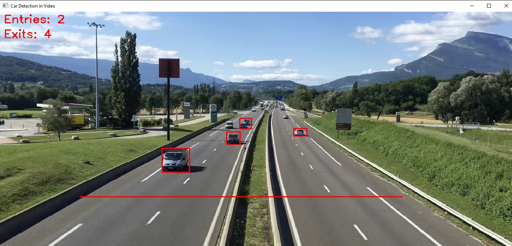
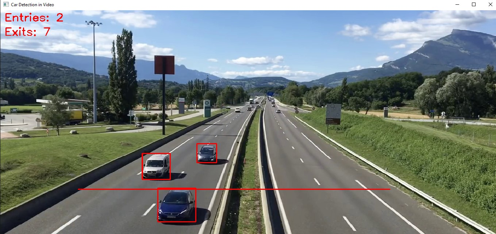

# Car Detection and Entry/Exit Tracking Using YOLO

This project uses the YOLO (You Only Look Once) model to detect and track cars in a video, counting how many cars enter and exit a specific region of interest (ROI) represented by a horizontal line in the video. It utilizes the `ultralytics` YOLO implementation and `OpenCV` for video processing and visualization.

## Features
- **Car Detection:** Detects and tracks cars using YOLO model.
- **Entry/Exit Tracking:** Tracks when a car crosses a specified horizontal line, incrementing the entry or exit count.
- **Bounding Box Visualization:** Draws bounding boxes around detected cars.
- **Entry/Exit Count Display:** Displays the number of cars that have entered and exited the region in real-time.

### Example Output

  
  

